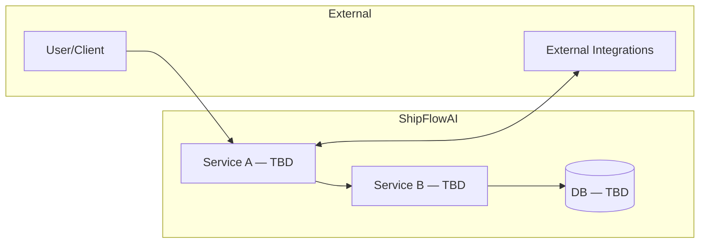
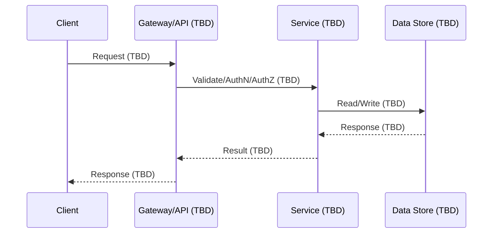

# Architecture Overview (TBD)

Purpose (TBD): Describe the system's high-level architecture, its core responsibilities, and how components interact. Update this as services/components are implemented.

## Checklist
- [ ] Core services/components and responsibility boundaries
- [ ] External integrations (LLM providers, vector DB, message bus, webhooks)
- [ ] Data stores and schemas (operational DB, cache, blob, analytics)
- [ ] AuthN/AuthZ model (users, tokens, roles)
- [ ] Deployment topology (environments, containers, scaling)
- [ ] Observability (logs, metrics, tracing)

## Context Diagram (TBD)

## Primary Request / Ingestion Flow (TBD)

## Components (TBD)
TBD: List components/services and describe their responsibilities and interfaces.

## Data Flow (TBD)
TBD: Describe end-to-end flows, including sync/async paths, queues, retries.

## Failure and Retry (TBD)
TBD: Identify failure modes, retry/backoff strategies, and idempotency.

## Security & Privacy (TBD)
TBD: AuthN/AuthZ, data classification, encryption at rest/in transit, secrets.

## Deployment & Ops (TBD)
TBD: Environments, containerization, scaling, CI/CD, backups, observability.
